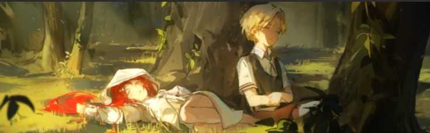

<!--
**KiriAky107/KiriAky107** is a ✨ _special_ ✨ repository because its `README.md` (this file) appears on your GitHub profile.
-->

> 
<em>
>     哲学家们只是用不同的方式解释世界，而问题在于改变世界。
>      
>     Die Philosophen haben die Welt nur verschieden interpretiert; es kommt darauf an, sie zu verändern。
>      
>     The philosophers have only interpreted the world, in various ways; the point is to change it。
> </em>

> 

>     &mdash;&mdash;&mdash;Karl Marx, Theses on Feuerbach (1845)
> 

## ✨ About Me

  

  🎓 <strong style="color: #8B5F7C;">Undergraduate Student</strong> (2024 – Present) 
  💻 <em style="color: #2C3E50; font-weight: 500;">Aspiring Full‑stack & AI Application Engineer</em> 
  🎹 Anime & Piano Enthusiast 
  📺 <strong style="color: #C06C84;">Favorite Anime:</strong> Mushoku Tensei · Sword Art Online · Kara no Kyoukai · Fate Series · Clannad 
  ✨ <strong style="color: #C06C84;">Favorite Visual Novel:</strong> Mahoutsukai no Yoru · ATRI · CLANNAD · Subarashiki Hibi · 9-nine- Series · Steins;Gate · Sakura no Uta 
  🎶 <strong style="color: #C06C84;">Favorite Music Style:</strong> Classical Piano · Japanese Light Music 
  📚 <strong style="color: #C06C84;">Philosophy:</strong> Dialectical Materialism · Historical Materialism 

  

  
  
  

 

<table align="center" width="100%">
  <tr>
    <td align="center" width="50%" valign="top">
      
    </td>
    <td align="center" width="50%" valign="top">
      
    </td>
  </tr>
</table>

  

---

## 🛠 Tech Stack

  <h3>💻 Frontend</h3>
  

    
  

  <h3>⚙️ Backend & Database</h3>
  

    
  

  <h3>🐳 DevOps & Tools</h3>
  

    
  

  <h3>🧠 AI & Data Science</h3>
  

    
  

  

    <em>✨ 正在探索：LLM应用开发 · Agent框架 ✨</em>
  

---

  

