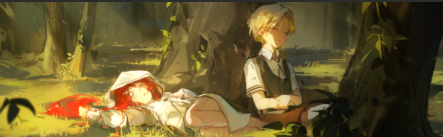
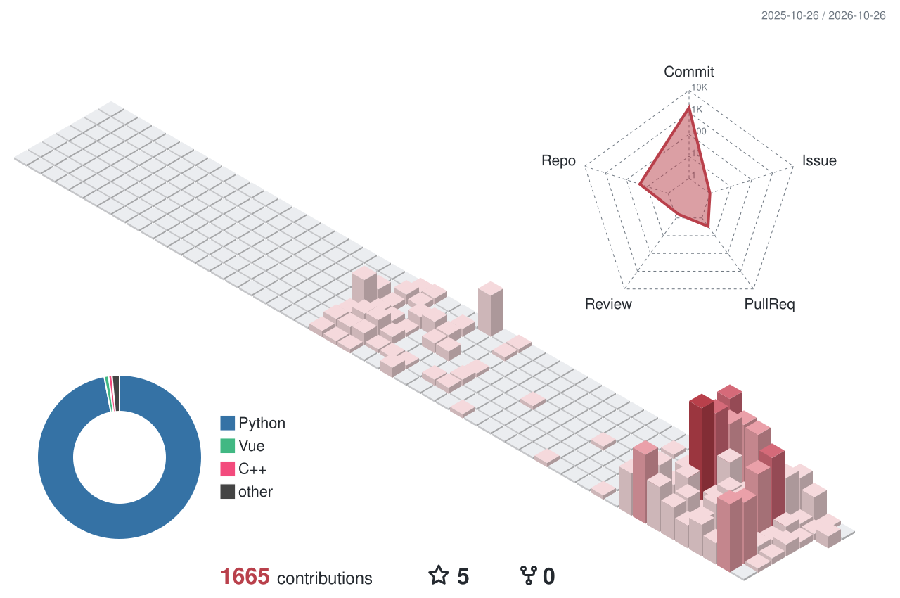

<blockquote>
  
<em>
    哲学家们只是用不同的方式解释世界，而问题在于改变世界。 
    The philosophers have only interpreted the world, in various ways; the point is to change it. 
    Die Philosophen haben die Welt nur verschieden interpretiert; es kommt darauf an, sie zu verändern.
  </em>

  
— Karl Marx, <em>Theses on Feuerbach</em> (1845)

</blockquote>

<h2 align="center">✨ About Me</h2>

  <strong>Ciallo～(∠・ω&lt;)⌒☆ Welcome to My Profile!</strong>

  🎓 <strong>Undergraduate Student</strong> (2024 – Present) 
  💻 <em>Aspiring Full‑stack &amp; AI Application Engineer</em> 
  🎹 Anime &amp; Piano Enthusiast 
  🎶 <strong>Favorite Music Style:</strong> Classical Piano · Japanese Light Music 
  📚 <strong>Philosophy:</strong> Dialectical Materialism · Historical Materialism

  <a href="https://blog.kronecker.cc">Blog</a> ·
  <a href="https://github.com/KiriAky107/Notes-Articles">Writing &amp; Poetry</a> ·
  <a href="https://github.com/KiriAky107?tab=repositories">Repositories</a> ·
  <a href="mailto:kiriaky_107@outlook.com">Email</a>

 

  

---

More

 

<table align="center" width="100%">
<tr>
<td width="50%" valign="top">
<h3>GitHub Activity</h3>

<picture>
<source media="(prefers-color-scheme: dark)" srcset="./profile/stats-dark.svg">

</picture>

<picture>
<source media="(prefers-color-scheme: dark)" srcset="./profile/top-langs-dark.svg">

</picture>

<picture>
<source media="(prefers-color-scheme: dark)" srcset="./profile/snake-dark.svg">

</picture>

<h3>Writing &amp; Projects</h3>

<strong><a href="https://github.com/KiriAky107/Notes-Articles">Notes &amp; Articles</a></strong> Essays, philosophy reading notes, and original poetry.

<strong><a href="https://github.com/KiriAky107/cpp-acm-notes-solutions">C++ / ACM Notes</a></strong> Algorithms, problem solving, diagrams, and runnable examples. <a href="https://kiriaky107.github.io/cpp-acm-notes-solutions/">Read online</a>

<strong><a href="https://github.com/KiriAky107/python-modern-notes-examples">Modern Python Notes</a></strong> Python fundamentals, software engineering, and practical examples. <a href="https://kiriaky107.github.io/python-modern-notes-examples/">Read online</a>

<strong><a href="https://github.com/KiriAky107/OpenNexus">OpenNexus</a></strong> A local-first AI notebook and knowledge workspace.

<h3>Tools &amp; Technologies</h3>

<strong>Languages</strong> C++ · Python · Rust · TypeScript

<strong>Desktop &amp; UI</strong> Tauri 2 · Vue 3 · Vite · Pinia

<strong>Services &amp; Data</strong> FastAPI · Pydantic · SQLite / FTS5 / sqlite-vec · PostgreSQL

<strong>AI Applications</strong> Agent · RAG · Skill · Plugin · MCP · Ollama

<strong>Development</strong> Git · Linux · Docker · GitHub Actions

</td>
<td width="50%" valign="top">

</td>
</tr>
</table>

